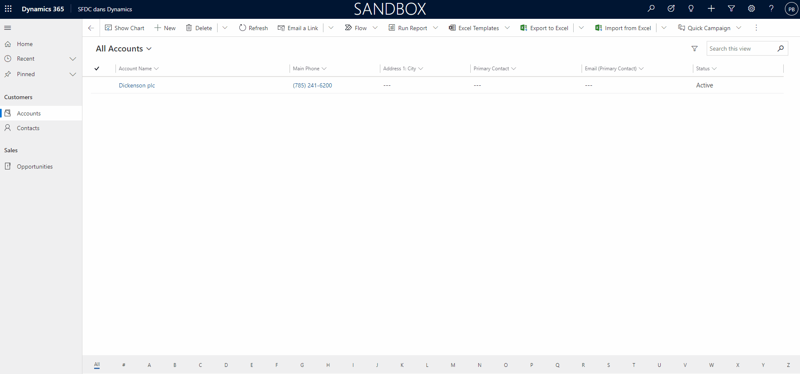

<h1 align="center">SFDC dans Dynamics</h1>

  

  

  

<!-- Status -->

<h4 align="center"> 
	🚧  SFDC dans Dynamics 🚀 Under construction...  🚧
</h4> 

  <a href="#dart-about">About</a> &#xa0; | &#xa0; 
  <a href="#sparkles-features">Features</a> &#xa0; | &#xa0;
  <a href="#rocket-technologies">Technologies</a> &#xa0; | &#xa0;
  <a href="#white_check_mark-requirements">Requirements</a> &#xa0; | &#xa0;
  <a href="#checkered_flag-starting">Starting</a> &#xa0; | &#xa0;
  <a href="#memo-license">License</a> &#xa0; | &#xa0;
  <a href="https://github.com/PeyoBouBou" target="_blank">Author</a>

 

## :dart: About ##

Intégration de Power Apps Canvas dans l'interface Salesforce

## :sparkles: Features ##

:heavy_check_mark: Voir les Opportunités d'un Salesforce dans un Dyanmcis 365 via une Power Apps Canvas

## :rocket: Technologies ##

The following tools were used in this project:

- [Power Apps](https://make.powerapps.com/)
- [Cloud Flow](https://flow.microsoft.com/)
- [Salesforce Connector](https://docs.microsoft.com/connectors/salesforce/)
- [NavigateToMainForm](https://docs.microsoft.com/powerapps/maker/model-driven-apps/embedded-canvas-app-actions#navigatetomainformentityname-mainformname-recordid)

## :white_check_mark: Requirements ##

Licence Power Apps "Per Apps" ou "Per User"

## :checkered_flag: Starting ##
La [Solution](https://docs.microsoft.com/powerapps/maker/data-platform/solutions-overview) s'adapte sur un environement Dataverse standard

## :memo: License ##

This project is under license from MIT. For more details, see the [LICENSE](../../LICENSE.md) file.

Made with :heart: by <a href="https://github.com/PeyoBouBou" target="_blank">PeyoBouBou</a>

&#xa0;

<a href="#top">Back to top</a>
